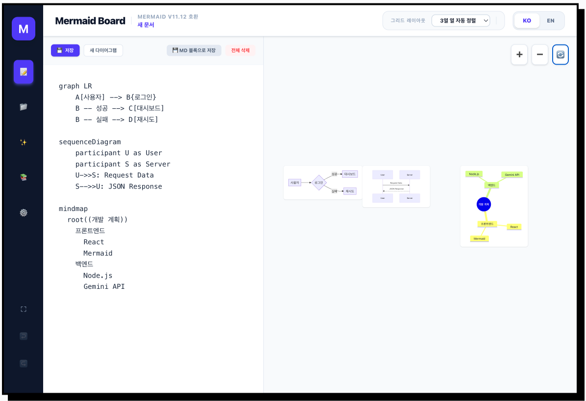

# mermaid-board

**Live Demo:** [https://studiojin.dev/utils/mermaid/](https://studiojin.dev/utils/mermaid/)

## About

A tool for viewing multiple Mermaid.js diagrams from a single code block. I often use Mermaid.js to create diagrams, but managing multiple separate diagrams became cumbersome. This tool lets you view multiple diagrams together in one place.

Currently, the WIGWIZ (interactive graph visualization) feature is implemented for **graph diagrams only**. Other diagram types have slightly different syntax, which requires additional consideration. This was a quick project today, so I focused on graph diagrams for now.

## Features

- View multiple Mermaid diagrams in a single interface
- WIGWIZ support for graph diagrams
- Easy code-to-visualization workflow

## Acknowledgments

This project uses mermaid.js (MIT License) for diagram rendering. Copyright (c) 2014-2022 Knut Sveidqvist

---

## Run Locally

This contains everything you need to run your app locally.

## Run Locally

**Prerequisites:**  Node.js

1. Install dependencies:
   `npm install`
2. Run the app:
   `npm run dev`
